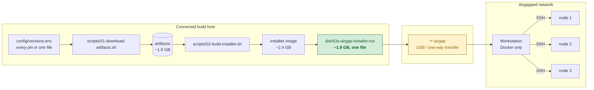
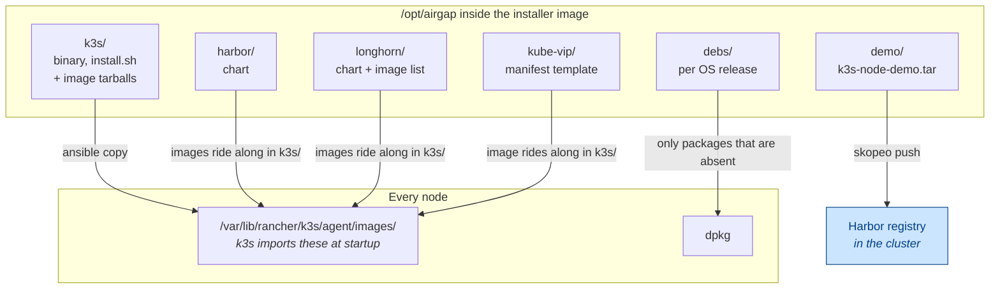
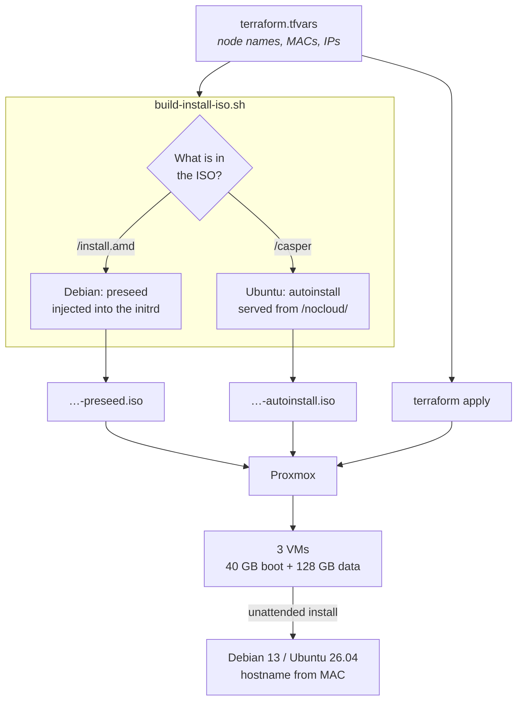
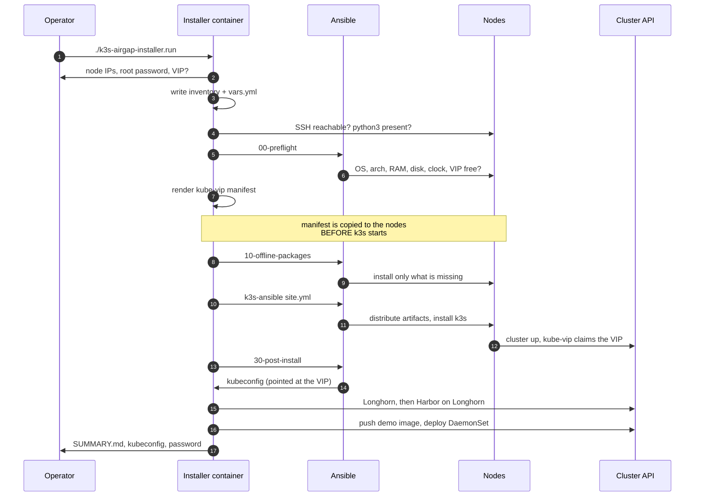
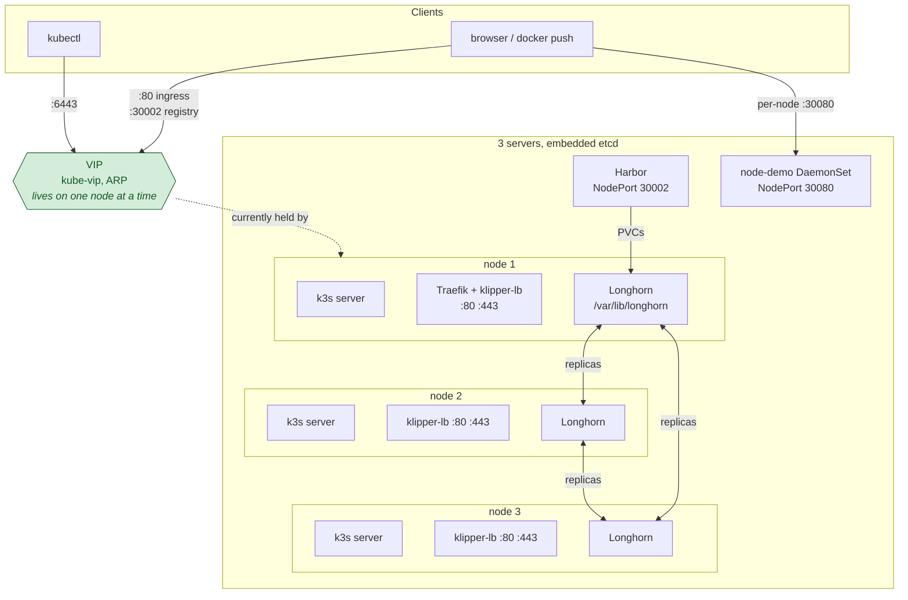
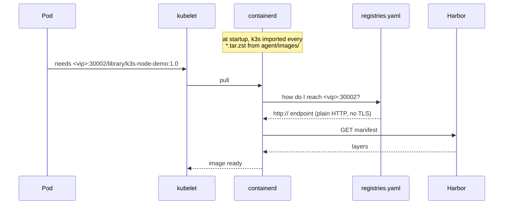
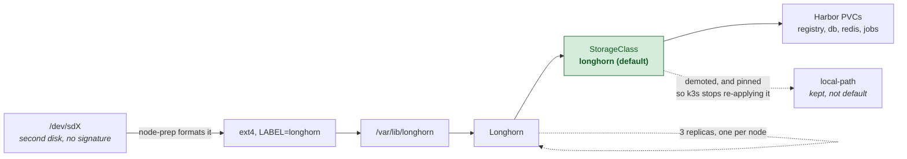
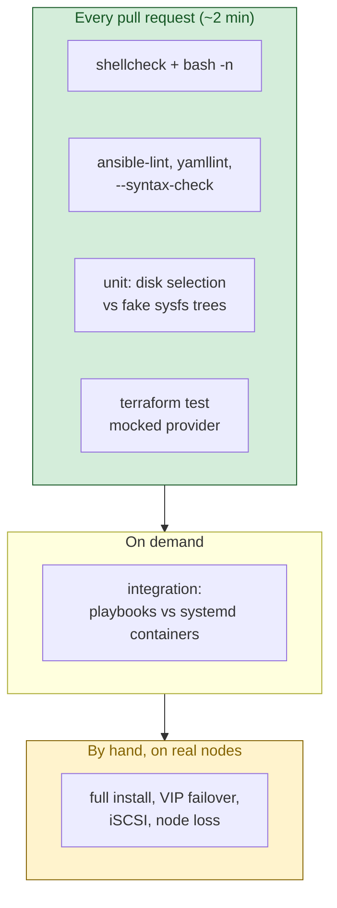

# Architecture

How the pieces fit together, and why they are arranged this way.

The whole design follows from one constraint: **the cluster nodes can never
reach the internet.** Everything that would normally be fetched on demand — a
container image, a Helm chart, a `.deb`, an installer script — has to be
identified, downloaded and carried across the gap in advance. Most of the
apparent complexity here is that constraint working itself out.

---

## 1. Two stages, one boundary

The `.run` file is a shell script with a gzipped Docker image appended to it.
Running it loads the image and starts the installer container; nothing else has
to exist on the airgapped side except Docker.

**Why a container rather than a tarball of scripts:** the installer needs
Ansible, `helm`, `kubectl`, `skopeo` and a matched set of Python libraries. On an
airgapped host you cannot install those. Shipping them inside an image is the
only way to guarantee the versions that were tested are the versions that run.

---

## 2. What is in the bundle, and who consumes it

Every image tarball is placed in the **same directory as the k3s bundle**, and
`roles/airgap` in the vendored collection copies `*.tar.zst` from there into
`/var/lib/rancher/k3s/agent/images/`. k3s imports whatever it finds there at
startup, so Harbor, Longhorn and kube-vip all have their images in containerd
before anything tries to pull them. That is the whole trick to a working
airgapped install, and it needs no code of our own.

The demo image is deliberately **not** preloaded. It is pushed into Harbor and
pulled back out again, so the demo proves the registry actually works rather
than quietly using a local copy.

---

## 3. Provisioning the nodes (optional)

One ISO installs all three machines. A preseed normally bakes in a single
hostname, which would produce three identically-named nodes — something
Kubernetes will not accept. Instead the ISO carries a **MAC-to-hostname table**
generated from `terraform.tfvars`, and a late script matches each machine
against it.

The flavour is detected from the ISO's *contents*, not its filename, because
Debian and Ubuntu share no configuration format: debian-installer reads a
preseed, Ubuntu Server runs subiquity autoinstall.

---

## 4. What the installer does

The ordering matters in two places:

- **kube-vip is rendered before the k3s install**, because the manifest is
  delivered through the collection's `extra_manifests`, which copies it into
  `/var/lib/rancher/k3s/server/manifests/` during the prereq role. k3s applies
  whatever is in that directory as soon as its API is up, so the VIP appears
  without a second pass.
- **Longhorn is installed before Harbor**, because Harbor's volumes land on it.

---

## 5. Runtime topology

**Why the VIP needs no load-balancer integration.** k3s's ServiceLB
(klipper-lb) binds host ports 80 and 443 on *every* node for the Traefik
service. The VIP is simply an address on one of those nodes, so a request to
`http://<vip>/` arrives on a node that is already listening. kube-vip runs with
`svc_enable=false`; nothing else is required.

**What the VIP does not change.** The nodes still join through node 1's real
address when k3s is installed — pointing the join at the VIP would deadlock,
since the VIP only exists once kube-vip is running, which needs the API that the
join is trying to reach. The VIP is added to the API certificate's SANs from the
first start, so it is valid the moment it appears.

---

## 6. Where an image comes from

`registries.yaml` is what makes a plain-HTTP registry work: without the explicit
`http://` endpoint, containerd would assume TLS and fail. It is written to every
node by the collection's `registries_config_yaml`, pointed at the VIP when there
is one.

---

## 7. Storage

The mount is by **filesystem label, not device path**, and the disk is chosen by
*absence of any signature* rather than by name. That is not fastidiousness:
attaching a disk to a running Proxmox VM can enumerate it ahead of the boot
disk, and on this cluster two nodes ended up with the new disk as `/dev/sda` and
root on `/dev/sdb`, while the third was the other way round. Anything that
assumed `/dev/sdb` would have reformatted root on two of three machines.

Usable capacity is the disk size divided by the replica count — 128 GB disks
with 3 replicas gives roughly 128 GB of volumes, stored three times.

---

## 8. Tests and CI

What is *not* covered is written down in [tests/README.md](tests/README.md)
rather than left implied: kernel modules and `iscsid` cannot run in a container,
`mock_provider` checks the plan and not the apply, and a whole cluster coming up
is verified by running the installer against real machines.
